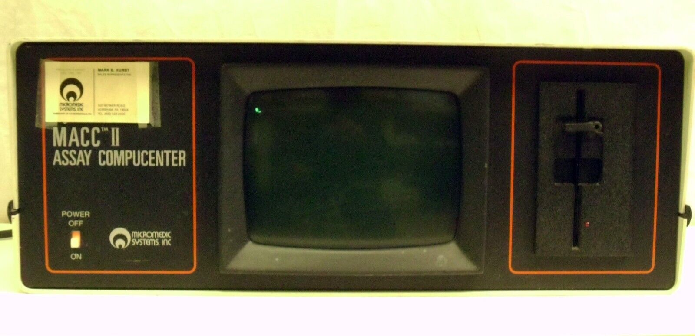

# MACC-II

# Description

I tend to collect the odds and ends of technology from the 70's and 80's. And adding to that collection is this MACC-II (Micromedic Assay CompuCenter). The MACC is for use with any Micromedic automated gamma counter or the CONCEPT 4 radioassay analyzer. So nuclear medicine.

On the other hand it's an interesting device. It has a Motorola MC68B00 8-bit processor. It has a TTL video card to interface to a 9" monitor. It has 4 MC6850 serial ports, of which one is used for an ASCII keyboard (working on a USB Keyboard to RS232 adapter). It has 2K of static RAM on the CPU card and a 64K DRAM card. And last but not least it has a WDC 1771 Floppy insterface connected to a SA455 drive. The odd part of this is the FD1771 is accessed via a MC68B21

# Notes

  # Puts the s19 @7800 (WRONG)
  srec_cat MACC-II.bin -binary -offset F000 -o MACC-II.s19 -Motorola 16  -Execution_Start_Address F806

  # Not working
  f9dasm -info macc-ii.info -6800  MACC-II.s19

  # uses MAC-II.bin
  f9dasm -info macc-ii.info

  # Works but no execution address
  srec_cat MACC-II.bin -binary -offset 0xF800 -o MACC-II.s19
  s0.sh "MACC-II ROM at F800 2716"
  # Manually add and delete the S0
